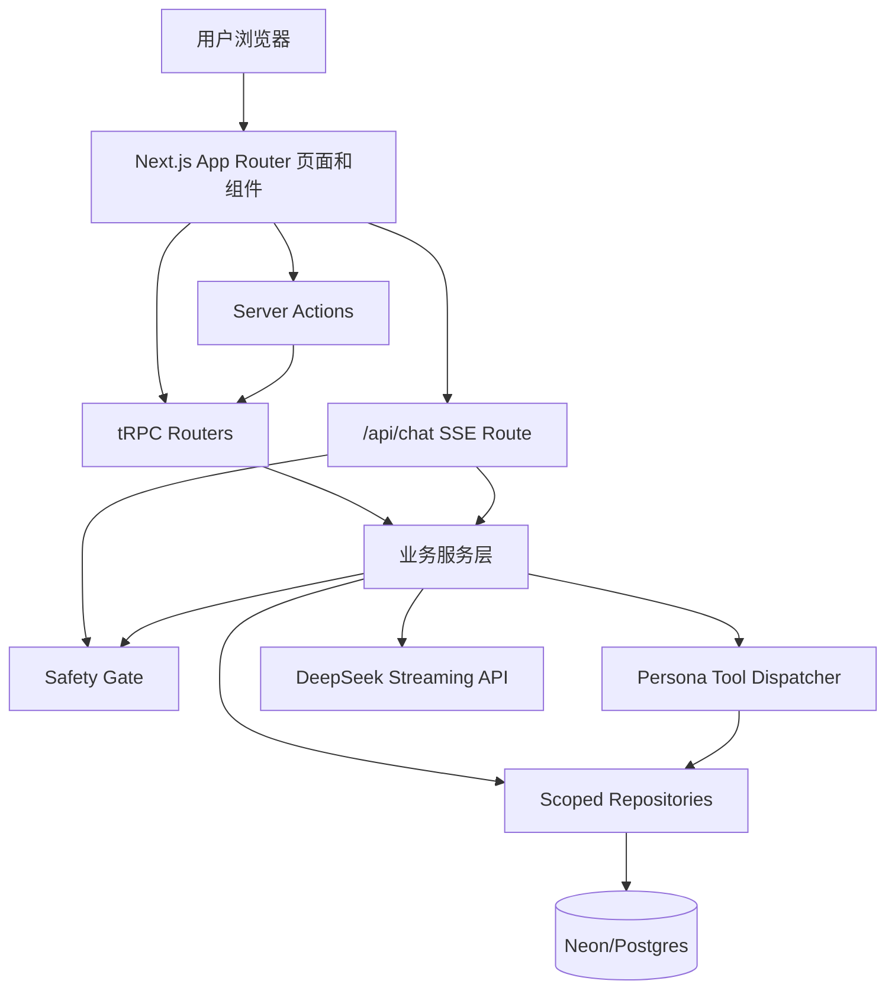

# Daimon

Daimon 是一个个人情绪支持陪伴 Agent 原型。产品形象是一只温柔的小恐龙：它不是医生或心理治疗师，而是用于提供陪伴、情绪命名、温和反思和行动整理的治愈型对话伙伴。

项目使用 Next.js App Router 构建全栈应用，采用 tRPC + Server Actions 组织业务接口，通过 Drizzle ORM 访问 Neon/Postgres 数据库，并接入 DeepSeek 流式聊天能力。核心设计目标是：在保证用户数据隔离和安全边界的前提下，让每个用户拥有一份由问卷生成、可持续演化的个人陪伴人格。

## 功能概览

- 账号系统：支持注册、登录、JWT Cookie 会话和受保护页面访问。
- 问卷向导：采集情绪状态、压力来源、支持偏好、生活情境和沟通偏好。
- 情绪画像：将问卷结果结构化为 profile，包括情绪状态、风险标记、沟通偏好和背景摘要。
- 人格生成：基于 profile 初始化 Daimon 人格，包含描述、角色边界、安全边界和分层人格章节。
- 流式聊天：用户消息通过 `/api/chat` 进入安全网关和 DeepSeek 流式响应，前端通过 SSE 实时渲染。
- 人格演化：Agent 可以提出新增、修改、删除人格章节或资源的建议，但必须由用户审批后才会落库。
- 安全网关：在读取人格 prompt 之前先检测危机信号，必要时短路普通对话并返回固定危机响应。
- 危机资源：提供深圳本地心理援助热线、康宁医院精神科急诊、120 和 110 等资源入口。

## 技术栈

| 层级 | 技术 |
| --- | --- |
| 前端框架 | Next.js 16 App Router, React 19 |
| UI | Tailwind CSS 4, shadcn/base-ui 风格组件, lucide-react |
| 动效 | GSAP |
| API | tRPC, Next Route Handlers, Server Actions |
| 数据库 | Neon/Postgres |
| ORM | Drizzle ORM, drizzle-kit migrations |
| AI | DeepSeek Chat Completions streaming |
| 鉴权 | bcryptjs, jose JWT, `daimon_session` Cookie |
| 校验 | Zod |
| Markdown | react-markdown, remark-gfm, Shiki |

## 总体架构



系统采用分层架构：

1. 表现层负责页面、表单、聊天 UI 和状态交互。
2. 接口层负责鉴权、输入校验和调用业务服务。
3. 服务层承载问卷处理、人格生成、聊天编排、安全检测等业务规则。
4. 仓储层统一处理数据库访问，并强制携带 `viewerUserId` 做数据隔离。
5. 数据层使用 Drizzle schema 和 migrations 管理 Postgres 表结构。

## 目录结构

```text
app/
  (auth)/                 登录、注册页面和表单动作
  (app)/                  登录后的主应用区域
  api/chat/               流式聊天 Route Handler
  api/trpc/[trpc]/        tRPC HTTP 入口
  questionnaire/          问卷向导和提交动作
components/
  app-shell/              应用壳、侧边栏和移动端导航
  ui/                     通用 UI 组件
db/
  schema.ts               Drizzle 数据模型
  migrations/             数据库迁移文件
lib/
  auth.ts                 当前用户解析
  session.ts              JWT Cookie 签发和校验
server/
  context.ts              tRPC 上下文
  trpc.ts                 protectedProcedure
  caller.ts               Server Component/Action 内复用 tRPC caller
  routers/                profile/persona/questionnaire/session 路由
services/
  ai/                     DeepSeek 流式接口封装
  chat/                   聊天编排和上下文构造
  persona/                人格模板、服务、工具和 proposal 机制
  profile/                情绪画像服务
  questionnaire/          问卷提交和 profile 生成
  safety/                 安全规则和危机响应
  storage/                数据仓储
types/
  domain.ts               领域类型
public/
  Daimon.png              Agent 头像/小恐龙形象
  main_page.png           主页背景图
  head_up.png             问卷背景图
```

## 分层设计

### 1. 表现层

页面主要位于 `app/` 下：

- `app/(app)/page.tsx` 是主页面，根据用户是否已有 profile/persona 展示不同状态。
- `app/questionnaire/questionnaire-wizard.tsx` 是 7 步问卷向导。
- `app/(app)/chat/[sessionId]/chat-view.tsx` 是聊天界面，负责 SSE 消息解析、工具调用展示和审批卡片展示。
- `app/(app)/persona/*` 负责人格总览、章节管理和最近变更。
- `app/crisis/page.tsx` 展示危机支持资源。

UI 组件集中在 `components/ui/`，应用壳在 `components/app-shell/`。页面尽量只处理展示和用户交互，复杂业务逻辑下沉到 server action、router 和 service。

### 2. 接口层

接口层由三类入口组成：

- tRPC：`app/api/trpc/[trpc]/route.ts` 暴露 profile、persona、questionnaire、session 等结构化业务接口。
- Server Actions：用于表单提交和服务端重定向，例如登录、注册、问卷提交、人格编辑。
- Chat Route：`app/api/chat/route.ts` 是原始 SSE 接口，适合处理流式对话。

`server/trpc.ts` 定义 `protectedProcedure`，所有受保护接口必须有当前用户。`server/caller.ts` 允许 Server Components 和 Server Actions 复用同一套 tRPC router，避免页面层重复写业务逻辑。

### 3. 服务层

服务层位于 `services/`，负责业务规则：

- `questionnaireService.submitResponses` 将表单响应转为结构化 profile，同时运行 safety check，并同步问卷种子章节。
- `personaService.createInitialPersona` 基于 profile 生成初始人格，包括小恐龙身份、描述、角色边界、危机边界和默认章节。
- `chatService.streamChatTurn` 负责聊天主流程：安全网关、构造上下文、调用 DeepSeek、处理工具调用、落库消息。
- `safety` 模块负责危机关键词检测和固定危机响应。
- `storage/repositories.ts` 是唯一数据库访问入口之一，所有业务表操作都以 `viewerUserId` 为作用域。

### 4. 数据层

数据模型定义在 `db/schema.ts`，迁移文件位于 `db/migrations/`。每个业务表都通过用户或人格关联实现隔离。

主要表：

| 表 | 作用 |
| --- | --- |
| `users` | 用户账号、邮箱、密码哈希和名称 |
| `profiles` | 用户情绪画像、问卷摘要、沟通偏好、风险标记 |
| `questionnaire_responses` | 原始问卷响应留存 |
| `emotion_assessments` | 历次情绪评分记录 |
| `agent_personas` | 每个用户一份 Daimon 人格元信息 |
| `persona_sections` | 人格章节，保存沟通风格、支持方式、用户背景等内容 |
| `persona_resources` | 人格补充资料，由 Agent 按需读取 |
| `persona_change_proposals` | Agent 提议修改人格内容的待审批队列和审计记录 |
| `sessions` | 聊天会话 |
| `messages` | 会话消息，按 `user_id + session_id` 查询 |

人格内容采用分层加载：

- Tier 1：`agent_personas`，始终进入 system prompt，包括描述、角色边界和危机边界。
- Tier 2：`persona_sections`，只把目录放入 prompt，正文由 Agent 通过工具按需读取。
- Tier 3：`persona_resources`，作为补充资料，同样按需读取。

这种设计避免每次对话把所有历史人格内容塞入 prompt，同时保留可扩展的人格记忆结构。

## 核心业务流程

### 注册与登录

1. 用户在登录/注册页提交表单。
2. 服务端 action 校验输入并使用 bcrypt 处理密码。
3. 登录成功后通过 `jose` 签发 7 天有效的 JWT。
4. JWT 写入 `daimon_session` Cookie。
5. App Shell、tRPC context 和 `/api/chat` 都会重新校验 Cookie。

开发环境下，如果没有登录态，`lib/auth.ts` 会回退到 `demo-user`，方便本地演示。生产环境必须有合法会话。

### 问卷到情绪画像

1. 用户进入 `/questionnaire` 完成 7 步问卷。
2. `submitQuestionnaireAction` 将表单数据提交给 tRPC。
3. `questionnaireService` 抽取关注领域、压力来源、支持偏好、睡眠、目标等字段。
4. 服务层生成：
   - `QuestionnaireSummary`
   - `EmotionState`
   - `CommunicationPreferences`
   - `RiskFlags`
5. profile、原始问卷和情绪评估写入数据库。
6. 如果用户已有 persona，则同步更新由问卷生成的种子章节。

### 人格生成

1. 用户在 profile 页点击生成人格。
2. `personaService.createInitialPersona` 读取当前 profile。
3. `buildPersonaBootstrapDraft` 构造 Daimon 初始人格：
   - 稳定身份：温柔、治愈感的小恐龙。
   - 角色边界：提供陪伴、澄清、情绪命名和行动整理。
   - 危机边界：遇到自伤/伤害他人等信号时交给安全网关。
   - 禁止行为：不做医学诊断、治疗承诺或药物建议。
   - 初始章节：沟通风格、支持方式、用户背景。
4. 数据写入 `agent_personas` 和 `persona_sections`。

### 聊天响应

1. 前端向 `/api/chat` 发送 `sessionId` 和用户消息。
2. Route Handler 校验当前用户和请求体。
3. `chatService.streamChatTurn` 先运行 Safety Gate。
4. 如果触发危机规则，服务直接返回固定危机响应，并写入消息记录。
5. 如果未触发危机，服务构造 system prompt：
   - Agent name
   - Stable Identity
   - Role Boundary
   - Crisis Boundary
   - Prohibited Moves
   - Description
   - Available Sections 目录
   - Output Contract
6. 服务调用 DeepSeek streaming API。
7. 前端通过 SSE 实时收到：
   - 文本增量
   - 工具调用
   - 工具结果
   - 最终 done 事件
8. 对话结束后 assistant 完整回复写入 `messages`。

### Agent 工具和人工审批

Agent 可以使用人格工具读取章节和资源，也可以提出修改建议。但工具层刻意限制了写权限：

- 可以读取章节和资源。
- 可以提出新增/修改/删除章节或资源。
- 不能直接修改 role boundary、crisis boundary 或 prohibited moves。
- 不能直接写入人格内容。

所有写入型建议都会进入 `persona_change_proposals`，前端展示审批卡片。只有用户点击批准后，仓储层才真正修改 `persona_sections` 或 `persona_resources`。这是一种 Human-in-the-loop 设计，避免 Agent 自行削弱安全边界或静默改写人格。

## 安全设计

Daimon 面向情绪支持场景，因此安全设计是核心部分。

### 数据隔离

- 业务表均通过 `user_id` 或 persona/session 关联归属用户。
- 仓储方法必须接收 `viewerUserId`。
- 查询消息时使用 `user_id + session_id` 双条件。
- tRPC 和 Route Handler 都会注入或校验当前用户。

### 安全网关

`services/safety/rules.ts` 定义危机和观察级别关键词，例如自杀、自残、绝望等表达。聊天流程在读取人格 prompt 前先执行检测：

- `level = none`：进入普通对话。
- `level = watch`：保留普通对话，但向前端返回安全状态。
- `level = crisis`：短路普通对话，返回固定危机模板。

这样可以避免在高风险场景下继续套用普通人格回复。

### 角色边界

人格模板明确规定：

- Daimon 是情绪支持陪伴 Agent，不是医生或心理治疗师。
- 不做诊断、治疗承诺、药物建议。
- 不强化自伤、绝望、妄想或依赖性表达。
- 危机边界不可由 Agent 自行修改。

## 环境变量

复制 `.env.example` 为 `.env`，并配置：

```bash
DATABASE_URL=""
DEEPSEEK_API_KEY=""
DEEPSEEK_MODEL="deepseek-v4-flash"
AUTH_JWT_SECRET=""
```

说明：

- `DATABASE_URL`：Neon/Postgres 连接串，运行数据库相关功能时必需。
- `DEEPSEEK_API_KEY`：本地开发可选；为空时聊天会返回本地占位回复。
- `DEEPSEEK_MODEL`：默认使用 `deepseek-v4-flash`。
- `AUTH_JWT_SECRET`：生产和登录注册功能必需，用于签发会话 JWT。

生成 JWT secret 示例：

```bash
openssl rand -base64 32
```

## 本地运行

安装依赖：

```bash
npm install
```

启动开发服务：

```bash
npm run dev
```

构建生产版本：

```bash
npm run build
npm run start
```

代码检查：

```bash
npm run lint
```

数据库迁移：

```bash
npm run db:generate -- --name your_change_name
npm run db:migrate
npm run db:studio
```

注意：生产构建使用 `next/font/google` 加载 Geist 字体，构建环境需要能够访问 Google Fonts。

## 部署说明

部署前需要准备：

1. 一个可访问的 Postgres 数据库，推荐使用 Neon。
2. 生产环境变量：
   - `DATABASE_URL`
   - `AUTH_JWT_SECRET`
   - `DEEPSEEK_API_KEY`
   - `DEEPSEEK_MODEL`
3. 一个可以执行 `npm install`、`npm run build` 和 `npm run start` 的 Node.js 运行环境。

### 数据库部署

首次部署或表结构变更后，需要在生产数据库执行迁移：

```bash
npm install
npm run db:migrate
```

如果修改了 `db/schema.ts`，先生成迁移文件并提交到仓库：

```bash
npm run db:generate -- --name describe_your_change
```

生产环境不建议直接修改数据库表结构，应通过 `db/migrations/` 中的迁移文件保持开发、测试和生产一致。

### Vercel 部署

本项目是标准 Next.js App Router 应用，可以部署到 Vercel。

1. 在 Vercel 导入仓库。
2. 在 Project Settings 中配置环境变量：
   - `DATABASE_URL`
   - `AUTH_JWT_SECRET`
   - `DEEPSEEK_API_KEY`
   - `DEEPSEEK_MODEL=deepseek-v4-flash`
3. 确认 Build Command 为：

```bash
npm run build
```

4. 确认 Install Command 为：

```bash
npm install
```

5. 在部署前或部署流水线中执行数据库迁移：

```bash
npm run db:migrate
```

Vercel 默认会运行 Next.js 的生产构建。由于项目使用 `next/font/google` 加载 Geist 字体，构建阶段需要能够访问 Google Fonts；如果构建网络无法访问 Google Fonts，需要改成本地字体或调整构建环境网络策略。

### Node.js 自托管部署

也可以部署到任意 Node.js 服务器、容器或 PaaS。

基本步骤：

```bash
npm install
npm run db:migrate
npm run build
npm run start
```

默认 `npm run start` 会启动 Next.js 生产服务。可以通过 `PORT` 指定端口：

```bash
PORT=3000 npm run start
```

如果使用 Docker 或进程管理器，建议：

- 将 `.env` 中的生产变量注入运行环境，不要提交真实密钥。
- 在应用启动前完成 `npm run db:migrate`。
- 使用 HTTPS 反向代理暴露服务。
- 保证部署环境可以访问 DeepSeek API 和数据库。

### 生产检查清单

- `AUTH_JWT_SECRET` 已设置为高强度随机值。
- `DATABASE_URL` 指向生产数据库，并启用 SSL。
- 数据库迁移已执行。
- `DEEPSEEK_API_KEY` 可用；否则聊天只能返回本地占位回复。
- 构建环境能访问 Google Fonts，或已替换为本地字体。
- 生产环境中不能依赖开发模式的 `demo-user` fallback。
- 危机资源电话和安全提示已按目标地区更新。

## 关键设计取舍

1. 使用 Server Components + Server Actions 简化表单和页面数据获取。
2. 使用 tRPC 统一类型安全 API，避免前后端手写重复 DTO。
3. 聊天接口单独使用 Route Handler 和 SSE，因为它需要流式返回。
4. 人格采用分层加载，降低 system prompt 体积。
5. Agent 写入人格必须经过 proposal 审批，避免越权和不可见修改。
6. Safety Gate 在人格 prompt 前运行，保证危机信号优先于个性化回复。
7. 仓储层强制传入 `viewerUserId`，把用户隔离规则落实到所有数据库访问。

## 当前限制

- Safety Gate 当前主要基于关键词规则，适合 MVP，不等同于完整临床风险评估。
- DeepSeek API Key 缺失时只能返回本地占位回复。
- 没有实现多端同步通知或长期记忆压缩任务调度。
- 问卷生成的人格章节是模板化生成，尚未接入更复杂的评估模型。

## 项目定位

Daimon 的定位不是替代专业心理咨询，而是一个受安全边界约束的个人情绪陪伴系统。它通过问卷建立初始理解，通过聊天持续互动，通过用户审批机制逐步演化人格内容，并在危机风险出现时优先引导用户联系现实世界的专业资源。
